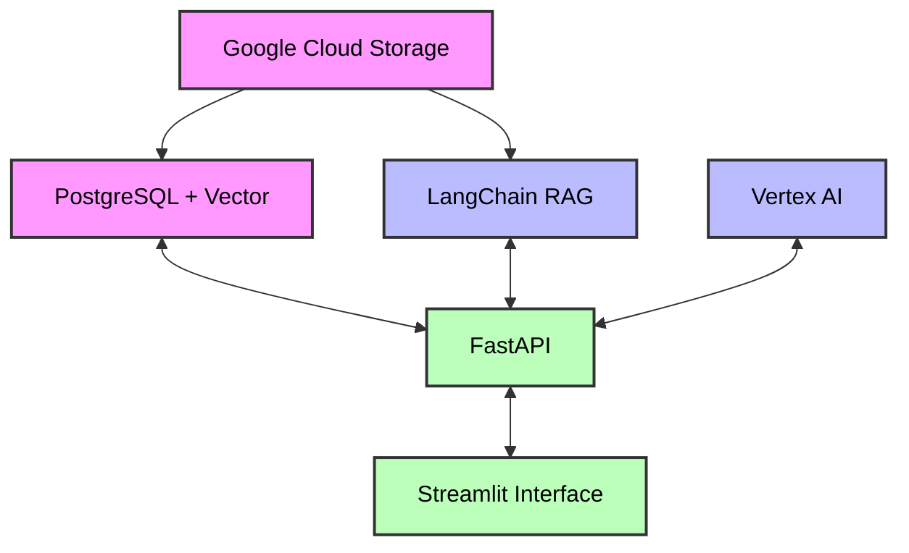

# SorakaBot - Assistant Médical Intelligent

## Description
SorakaBot est un assistant médical virtuel intelligent basé sur un système RAG (Retrieval-Augmented Generation). Il combine une base de connaissances médicales structurée avec les capacités de génération de texte du modèle Gemini pour fournir des réponses précises et contextualisées aux questions médicales.

## Architecture du Projet

| Composant | Rôle |
|-----------|------|
| **Google Cloud Storage** | Stockage des données brutes et des modèles |
| **PostgreSQL + PGVector** | Base de données avec capacités vectorielles pour la recherche sémantique |
| **FastAPI** | Backend API RESTful pour servir les données et les prédictions |
| **LangChain RAG** | Framework de Retrieval Augmented Generation pour l'analyse contextuelle |
| **Vertex AI** | Plateforme ML pour l'entraînement et l'inférence des modèles |
| **Streamlit** | Interface utilisateur interactive pour explorer les analyses |

Les composants sont connectés comme suit :
- Cloud Storage alimente PostgreSQL avec les données
- FastAPI communique avec LangChain et PostgreSQL
- Vertex AI fournit les capacités d'IA
- Streamlit propose une interface utilisateur connectée à FastAPI





## Fonctionnalités
- 🔍 Recherche sémantique dans une base de données médicale
- 💬 Réponses précises basées sur des sources fiables
- 🌐 Interface multilingue (Français, Anglais, Arabe)
- 🔄 Conservation du contexte des conversations
- 📊 Affichage des sources et scores de confiance

## Installation et Configuration

### Prérequis
- Python 3.10+
- Compte Google Cloud Platform avec API Vertex AI activée
- Instance Cloud SQL PostgreSQL
- Clé API Gemini

### Installation locale
1. Cloner le dépôt :
   ```bash
   git clone https://github.com/votre-utilisateur/sorakabot.git
   cd sorakabot

2. Créer un environnement virtuel :
    ```bash
    python -m venv venv
    source venv/bin/activate   # Sur Windows: venv\Scripts\activate

3. Installer les dépendances :
    ```bash
    pip install -r requirements.txt

4. Configurer les variables d'environnements : 
    ```bash
    # .env
    API_KEY=votre_clé_api_gemini
    DB_PASSWORD=votre_mot_de_passe_db

6. Télécharger et lancer le proxy Cloud SQL :
    ```bash
    # Dans un terminal
    
    ./cloud-sql-proxy.exe projet-gcp-450616:europe-west1:soraka-instance

8. Lancer l'API et l'interface utilisateur :
    ```bash
    # Dans un terminal
    python api.py

    # Dans un autre terminal
    streamlit run app.py


## Evaluation 

Les performances du système ont été évaluées selon plusieurs métriques :

- Pertinence moyenne : 0.7376

- Temps de réponse moyen : 2.8 secondes

- Taux de récupération DB : Mesure la qualité de la récupération d'information

## Limitations

- Performance limitée sur les questions très spécifiques non présentes dans la base de données

- Nécessite une formulation claire des questions

- Informations potentiellement incomplètes sur des sujets médicaux émergents

## Structure du projet

```plaintext
sorakabot/
- api.py                # API FastAPI pour la gestion des requêtes backend
- app.py                # Interface utilisateur Streamlit
- ingest.py             # Script pour l'ingestion des données dans la base
- retrieve.py           # Fonctions de récupération des données
- utils_eval.py         # Outils utilitaires pour l'évaluation du système
- eval.py               # Script principal d'évaluation des performances
- config.py             # Fichier de configuration du projet
- requirements.txt      # Liste des dépendances Python nécessaires
- Dockerfile_api        # Dockerfile pour conteneuriser l'API FastAPI
- Dockerfile_streamlit  # Dockerfile pour conteneuriser l'interface Streamlit
- downloaded_files/     # Répertoire pour les fichiers téléchargés
```

## Considérations éthiques


- SorakaBot est un outil d'information et ne remplace en aucun cas une consultation médicale professionnelle

- Les sources et scores de confiance sont systématiquement affichés

- Aucune donnée utilisateur n'est stockée de manière permanente

## Licence
Ce projet est sous licence MIT.

## Contact

Pour toute question ou suggestion, veuillez me contacter à bharjihed@gmail.com 


